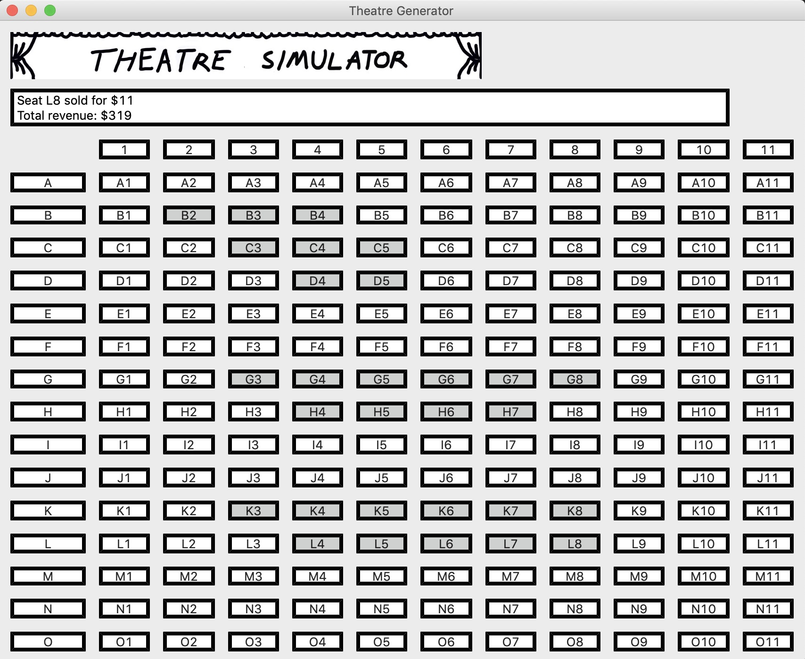

# Theatre Simulator

Simple GUI theatre simulator that allows the user to sell seats, rows, or columns, written in python. 
Uses PyQt5 python bindings.

In the screenshot, multiple seats have been sold (in grey) with L8 being the last seat sold.

## Install PyQt5:
Create a virtual environment to hold libraries:
```bash
python3 -m venv venv
```
This creates the venv/ folder. To activate the virtual environment on Windows, run:
```bash
call venv/scripts/activate.bat
```
On Mac and Linux, use:
```bash
source venv/bin/activate
```
Now in the virtual environment, use the package manager [pip](https://pip.pypa.io/en/stable/) to install PyQt5.
```bash
pip install PyQt5
```
Visit [PyQt5](https://pypi.org/project/PyQt5/) for more.
